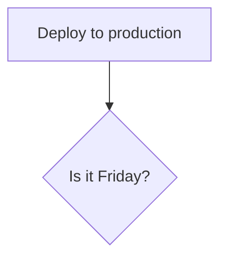

[square root of a number - leetcode](https://leetcode.com/problems/sqrtx/)


```java
public int mySqrt(int x) {
    
    double low = 1;
    double high = x;

    while((high - low) > ) {

    }


}
```

