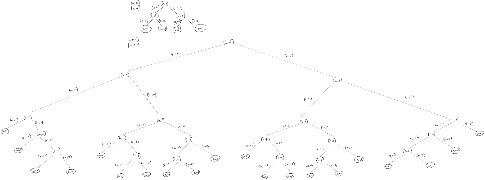

## Bruteforce approach - Memory Limit Exceeded:

Time = $O(n^{2})$  
Space = $O(n^{2})$

generating all pairs and storing in min heap to get the top K

```java
public List<List<Integer>> kSmallestPairs(int[] nums1, int[] nums2, int k) {
    List<Pair<Integer, Pair<Integer, Integer>>> list = new ArrayList<>();

    for (int i=0;i<nums1.length;i++) {
        for (int j=0;j<nums2.length;j++) {
            list.add(new Pair<>(nums1[i] + nums2[j], new Pair<>(nums1[i], nums2[j])));
        }
    }

    Collections.sort(list, (p1, p2) -> {
        return p1.getKey() - p2.getKey();
    });

    List<List<Integer>> ans = new ArrayList<>();
    for (int i = 0; i < list.size() && k-- > 0; i++) {
        Pair<Integer, Pair<Integer, Integer>> pair = list.get(i);
        Pair<Integer, Integer> keyValue = pair.getValue();
        ans.add(List.of(keyValue.getKey(), keyValue.getValue()));
    }
    return ans;
}
```


## Optimal approach:

Time = $O(k*log(k))$  
Space = $O(n)$

below is the search space by either (0,+1) or (+1,0) in the (u,v) pairs




in the above tree, we insert each subtree in a priority queue and search only the smallest sum

```java

public List<List<Integer>> kSmallestPairs(int[] nums1, int[] nums2, int k) {
    PriorityQueue<int[]> minHeap = new PriorityQueue<>((int[] a, int[] b) -> {
        return a[0] - b[0];
    });
    minHeap.add(new int[] {nums1[0] + nums2[0], 0, 0});

    List<List<Integer>> ans = new ArrayList<>();
    while (!minHeap.isEmpty() && k > 0) {
        int[] top = minHeap.poll();
        int a = top[1];
        int b = top[2];
        ans.add(List.of(nums1[a], nums2[b]));
        k--;

        if (a+1 < nums1.length) {
            minHeap.add(new int[] {nums1[a+1] + nums2[b], a+1, b});
        }

        if (b+1 < nums2.length) {
            minHeap.add(new int[] {nums1[a] + nums2[b+1], a, b+1});
        }
    }
    return ans;
}
```

the above solution gives duplicate entries since the search space also includes previous entries because of the 0 in the (0,+1) and (+1,0) pairs

```java
public List<List<Integer>> kSmallestPairs(int[] nums1, int[] nums2, int k) {
    PriorityQueue<int[]> minHeap = new PriorityQueue<>((int[] a, int[] b) -> {
        return a[0] - b[0];
    });
    minHeap.add(new int[] {nums1[0] + nums2[0], 0, 0});

    Set<String> set = new HashSet<>();
    set.add("00");

    List<List<Integer>> ans = new ArrayList<>();
    while (!minHeap.isEmpty() && k > 0) {
        int[] top = minHeap.poll();
        int a = top[1];
        int b = top[2];
        ans.add(List.of(nums1[a], nums2[b]));
        k--;

        String aIndex = (a+1) + "," + b;
        System.out.println(aIndex);
        if (a+1 < nums1.length && !set.contains(aIndex)) {
            minHeap.add(new int[] {nums1[a+1] + nums2[b], a+1, b});
            set.add(aIndex);
        }

        String bIndex = a + "," + (b+1);
        System.out.println(bIndex);
        if (b+1 < nums2.length && !set.contains(bIndex)) {
            minHeap.add(new int[] {nums1[a] + nums2[b+1], a, b+1});
            set.add(bIndex);
        }
    }
    return ans;
}
```