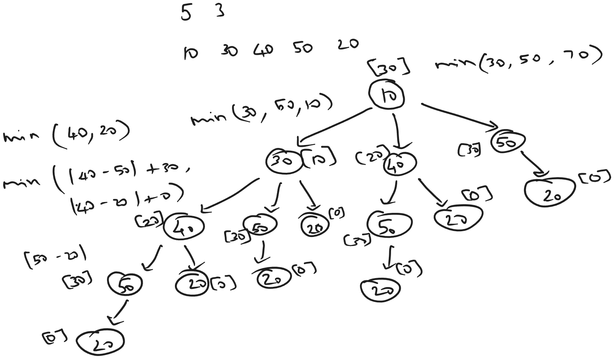

[atcoder](https://atcoder.jp/contests/dp/tasks/dp_b)

### Sample Input 1
5 3

10 30 40 50 20

### Sample Output 1
30



>Same as frog1 problem except the next stone steps is not exactly two but can be more.

### Recurrence relation

$$
\text{minCost}(n) = \min_{1 \leq j \leq k} \left( |h_n - h_{n+j}| + \text{minCost}(n+j) \right)
$$

## Optimized Iterative Approach - Tabulation - Bottom up

```java
private static int tabulationIterativeMinCost(int[] arr, int K) {

    int n = arr.length;

    // base cases
    if (n <= 1) return 0;

    
    int[] buffer = new int[n];
    buffer[n-1] = 0; // not required, but done for understanding

    // initializing with max value since the comparison
    // is done with the self value of i
    for (int i = 0; i < n-1; i++) {
        buffer[i] = Integer.MAX_VALUE;
    }

    for (int i = n-2; i >= 0; i--) {

        for (int j = 1; j <= K && (i+j) < arr.length; j++) {
            buffer[i] = Math.min(
                buffer[i],
                Math.abs(arr[i] - arr[i+j]) + buffer[i+j]
            );
        }
    }

    return buffer[0];
}
```