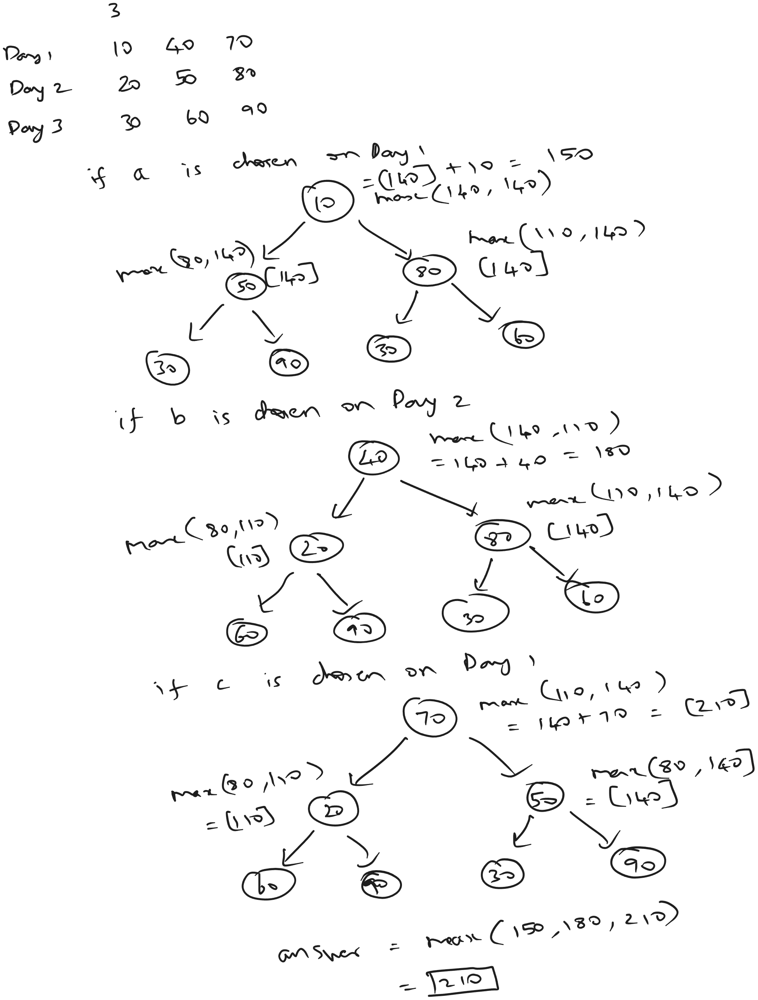

[atcoder](https://atcoder.jp/contests/dp/tasks/dp_c)

### Sample Input 1
3

10 40 70
20 50 80
30 60 90

### Sample Output 1
210



### Can we go with greedy approach?

Is it fine if we can go with greedy approach, by selecting the maximum happines for that particular day excluding the task done on previous day?

this will not be feasible in the case where two or more tasks have same happiness at a particular day. the state tree must explore both combinations and cannot greedily select one task.

this is evident with sample input 3. where on second day both task A and B have the same happiness.

### Recurrence relation

$$
maxHappiness(day_j) = \max_{k \neq j} (arr[day][k] + maxHappiness((day+1)_k))
$$

## Bruteforce Recursive Approach

```java
private static int maxHappiness(int[][] arr, int index, int day) {

    if (day >= arr.length) {
        return 0;
    }

    int max = 0;
    for (int i = 0; i < 3; i++) {

        if (i != index)
            max = Math.max(max, arr[day][i] + maxHappiness(arr, i, day+1));
    }
    return max;
}
```

## Memoized Recursive Approach - Top Down

### Wrong Solution

```java
private static int maxHappinessMemoizedTopDownWrong(int[][] arr, int index, int day, int[] dp) {

    if (day >= arr.length) {
        return 0;
    }

    if (dp[day] != 0) {
        return dp[day];
    }

    for (int i = 0; i < 3; i++) {

        if (i != index)
            dp[day] = Math.max(dp[day], arr[day][i] + maxHappinessMemoizedTopDownWrong(arr, i, day+1, dp));
    }

    return dp[day];
}
```

above solution doesn't maintain the previous day selected task. hence a 2d buffer must be used to store the previous day chosen task.

### Correct Solution

```java
private static int maxHappinessMemoizedTopDown(int[][] arr, int index, int day, int[][] dp) {

    if (day >= arr.length) {
        return 0;
    }

    if (dp[day][index] != 0) {
        return dp[day][index];
    }

    for (int i = 0; i < 3; i++) {

        if (i != index)
            dp[day][index] = Math.max(dp[day][index], arr[day][i] + maxHappinessMemoizedTopDown(arr, i, day+1, dp));
    }

    return dp[day][index];
}
```

## Optimized Tabulation Approach - Bottom Up

```java
private static void maxHappinessTabulationBottomUp(int[][] arr, int[][] dp) {
    // base cases
    dp[arr.length - 1][0] = arr[arr.length - 1][0];
    dp[arr.length - 1][1] = arr[arr.length - 1][1];
    dp[arr.length - 1][2] = arr[arr.length - 1][2];

    for (int day = arr.length - 2; day >= 0; day--) {
        for (int task = 0; task < 3; task++) {
            for (int i = 0; i < 3; i++) {
                if (i != task)
                    dp[day][task] = Math.max(dp[day][task], arr[day][task] + dp[day+1][i]);
            }
        }
    }
}
```