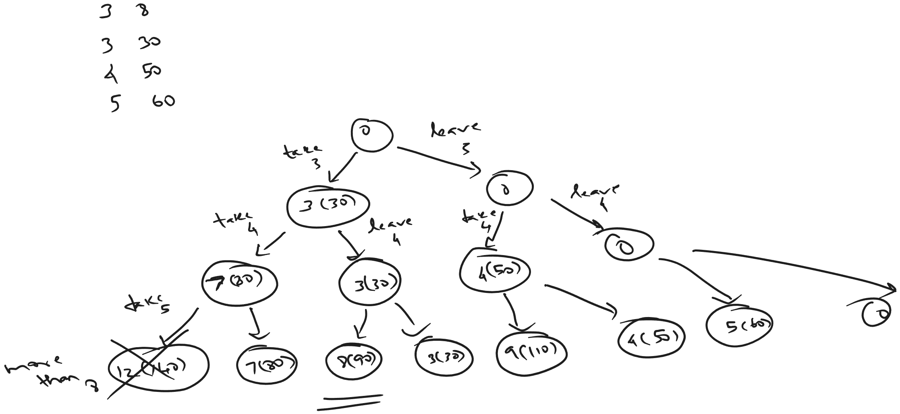
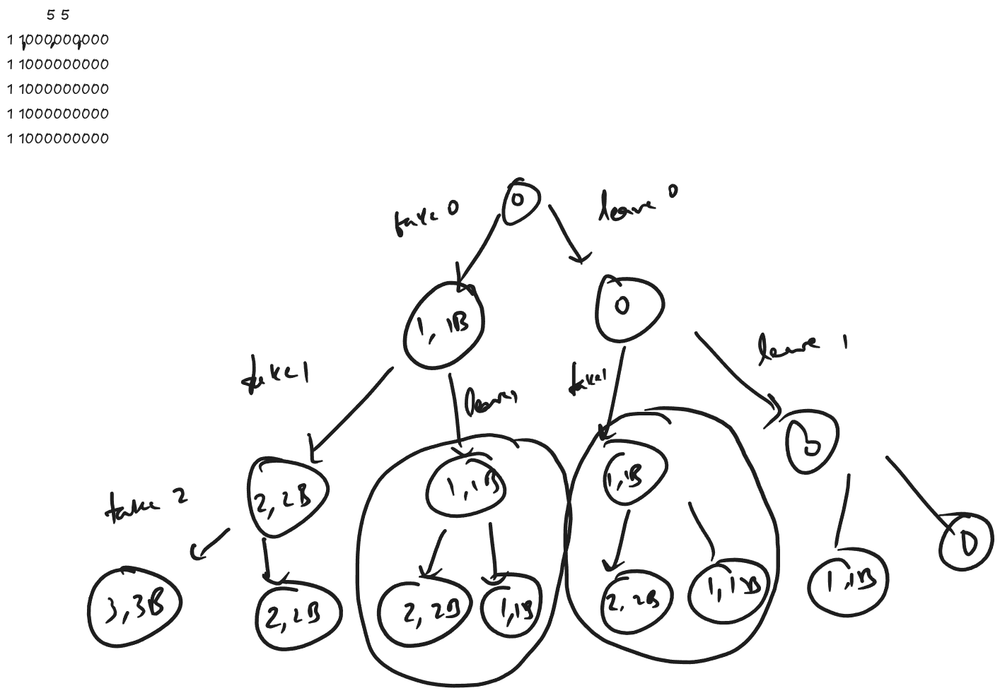
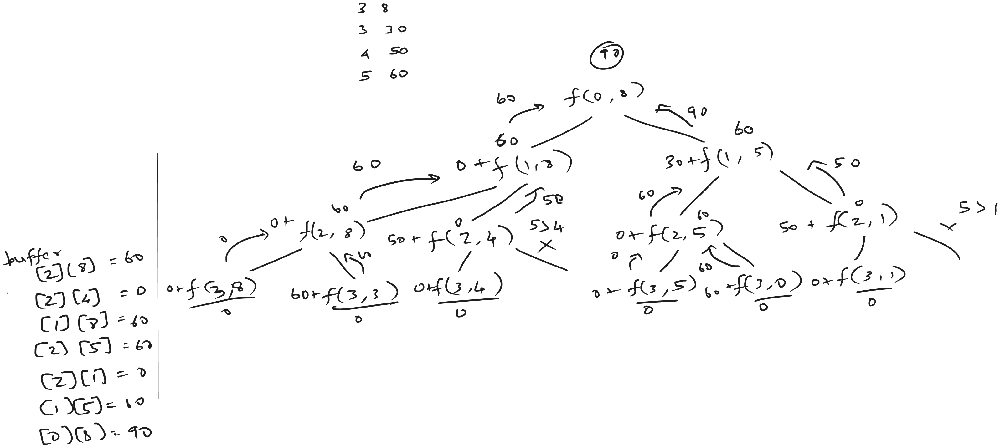

[atcoder](https://atcoder.jp/contests/dp/tasks/dp_d)

### Sample Input 1
3 8
3 30
4 50
5 60

### Sample Output 1
90



## Bruteforce Recursive Approach

Time Complexity - $O(2^n)$

```java
private static long bruteForceKnapSack(int[][] arr, int W, int index, int weightSum, long valueSum) {
    if (index >= arr.length) {
        return valueSum;
    }

    long take = weightSum + arr[index][0] <= W ? 
        bruteForceKnapSack(arr, W, index+1, weightSum + arr[index][0], valueSum + arr[index][1]) : 
        valueSum;
    long leave = bruteForceKnapSack(arr, W, index+1, weightSum, valueSum);

    return Math.max(take, leave);
}
```

### Recurrence relation

$$
\text{maxValue} = \max_{i=1}^{n} (\text{take}_i, \text{leave}_i)
$$

from the state tree for sample input 1 and the recurrence relation i cannot see repeated subtasks. can this be solved using dynamic programming?




from the above state tree if the value is same for two items and the remaining weight of the bag is same, then the tree is similar. so there can be operations done to reduce the recursion in case of same value with same remaining weight.

so the variables of interest are the remaining weight of the bag and the current item.

## Bruteforce Recursive Approach - With proper state variables

Time Complexity - $O(2^n)$

```java
private static long bruteForceKnapSackWithoutExtraStates(int[][] arr, int W, int index) {
    if (index >= arr.length || W == 0) {
        // if the current index is greater than the bounds or, 
        // if the bag capacity is already 0
        // simply not take the element into consideration.
        // and do not proceed further with any recursive calls.
        return 0;
    }

    long leave = 0 + bruteForceKnapSackWithoutExtraStates(arr, W, index+1);
    long take = Integer.MIN_VALUE;

    if (arr[index][0] <= W) {
        take = arr[index][1] + bruteForceKnapSackWithoutExtraStates(arr, W - arr[index][0], index+1);   
    }
    return Math.max(take, leave);
}
```

Instead of using multiple state variables, we can use only the current capacity and the current index.

> Why is `weightSum` not required? <br>
> instead of accumulating the current weight of bag in a separate variable, subtract it from the overall bag capacity.

> Why is `valueSum` not required? <br>
> value accumulation, instead of done separately, can be done during computation of the current element value.


## Optimized Recursive Approach - With Memoization

go through sample input 2 state tree
we can see that if two items with same weight, can repeat the subtree recursion again.
so to eliminate those we can use memoization.

this solution actually passed in atcoder, but still it is not optimal



```java
private static long bruteForceKnapSackWithMemoization(int[][] arr, int W, int index, long[][] buffer) {
    if (index >= arr.length || W == 0) {
        // if the current index is greater than the bounds or, 
        // if the bag capacity is already 0
        // simply not take the element into consideration.
        // and do not proceed further with any recursive calls.
        return 0;
    }
    if (buffer[index][W] != -1) return buffer[index][W];

    long leave = 0 + bruteForceKnapSackWithMemoization(arr, W, index+1, buffer);
    long take = Integer.MIN_VALUE;

    if (arr[index][0] <= W) {
        take = arr[index][1] + bruteForceKnapSackWithMemoization(arr, W - arr[index][0], index+1, buffer);   
    }

    buffer[index][W] = Math.max(take, leave);
    return buffer[index][W];
}
```


<strong>
One important take away is  

</strong>
I am not able to think of a optimized approach from the first bruteforce approach implemented.  

So always think of a bruteforce solution with minimal variables being passed to the function.  
From this able to think of a memoization approach.


### Intuition
In the recursive memoized approach, the buffer table is being filled only for the necessary sub problems and not the complete buffer.


