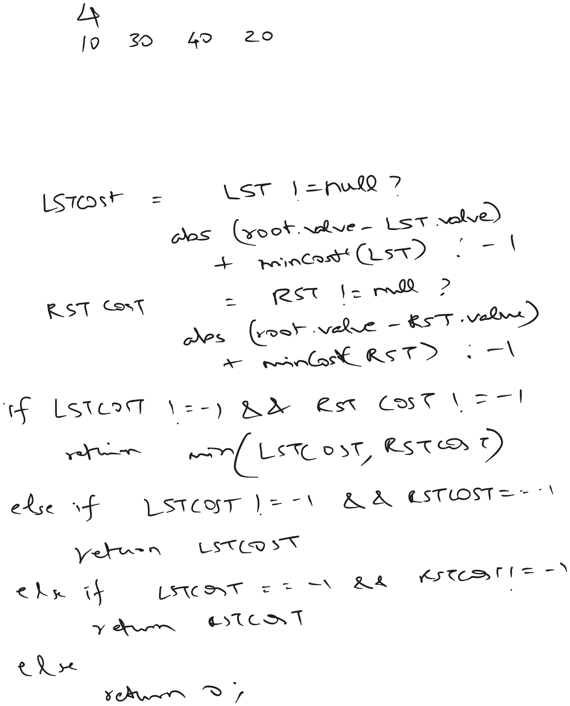
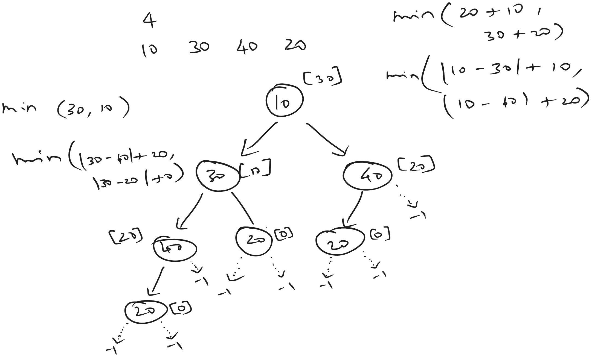
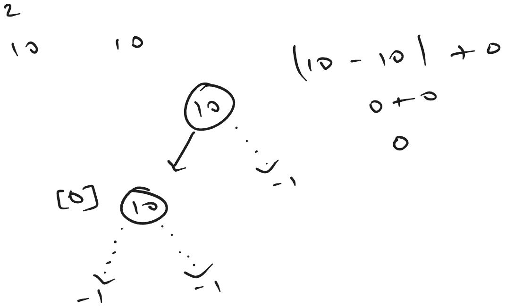
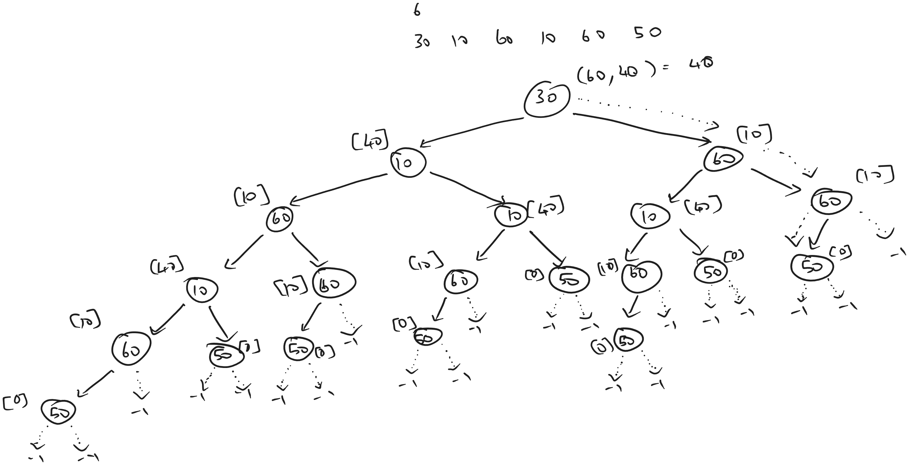

[atcoder](https://atcoder.jp/contests/dp/tasks/dp_a)

## Bruteforce Recursive Approach



### Sample Input 1
4

10 30 40 20

### Sample Output 1
30




### Sample Input 2
2

10 10

### Sample Output 2
0



### Sample Input 3
6

30 10 60 10 60 50

### Sample Output 3
40




### Solution
```java
private static int minCost(int[] arr, int index) {
    int leftTreeMinCost = index + 1 < arr.length ? 
        Math.abs(arr[index] - arr[index + 1]) + minCost(arr, index + 1) : -1;
    int rightTreeMinCost = index + 2 < arr.length ? 
        Math.abs(arr[index] - arr[index + 2]) + minCost(arr, index + 2) : -1;

    if (leftTreeMinCost != -1 && rightTreeMinCost != -1) {
        return Math.min(leftTreeMinCost, rightTreeMinCost);
    } else if (leftTreeMinCost == -1 && rightTreeMinCost != -1) {
        return rightTreeMinCost;
    } else if (leftTreeMinCost != -1 && rightTreeMinCost == -1) {
        return leftTreeMinCost;
    } else {
        return 0;
    }
}
```

>as expected the recursive bruteforce solution is exceeding time limit.


## Bruteforce Recursive Approach - Memoization

Since calculations are getting repeated again and again, we can check if an index position is already calculated.

Use a memory buffer to store minimum cost at each index and fetch them if required.

```java
private static int memoizedBruteforceRecursiveMinCost(int[] arr, int index, int[] buffer) {
    int leftTreeMinCost = -1;
    if (index + 1 < arr.length) {
        if (buffer[index + 1] != -1) {
            leftTreeMinCost = Math.abs(arr[index] - arr[index + 1]) + buffer[index + 1];
        } else {
            leftTreeMinCost = Math.abs(arr[index] - arr[index + 1]) + memoizedBruteforceRecursiveMinCost(arr, index + 1, buffer);
        }
    }

    int rightTreeMinCost = -1;
    if (index + 2 < arr.length) {
        if (buffer[index + 2] != -1) {
            rightTreeMinCost = Math.abs(arr[index] - arr[index + 2]) + buffer[index + 2];
        } else {
            rightTreeMinCost = Math.abs(arr[index] - arr[index + 2]) + memoizedBruteforceRecursiveMinCost(arr, index + 2, buffer);
        }
    }

    if (leftTreeMinCost != -1 && rightTreeMinCost != -1) {
        int currentIndexMinCost = Math.min(leftTreeMinCost, rightTreeMinCost);
        buffer[index] = currentIndexMinCost;
        return currentIndexMinCost;
    } else if (leftTreeMinCost == -1 && rightTreeMinCost != -1) {
        buffer[index] = rightTreeMinCost;
        return rightTreeMinCost;
    } else if (leftTreeMinCost != -1 && rightTreeMinCost == -1) {
        buffer[index] = leftTreeMinCost;
        return leftTreeMinCost;
    } else {
        buffer[index] = 0;
        return 0;
    }
}
```

>this solution is time optimized and accepted. but there is an extra additional space being used.


### Recurrence relation

$$
minCost(n) = min{(|n - (n+1)| + minCost(n+1)), (|n - (n+2)| + minCost(n+2))}
$$