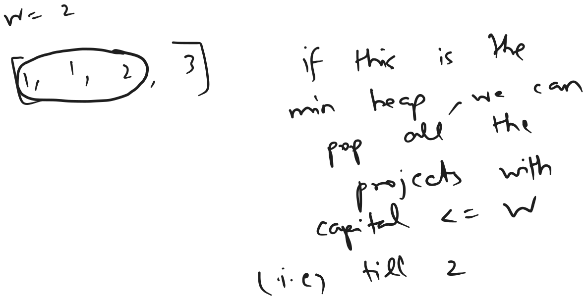
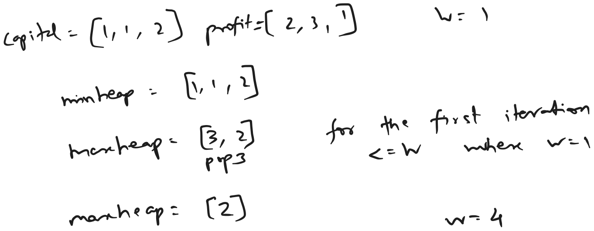

[leetcode - 502 IPO](https://leetcode.com/problems/ipo/description/?envType=study-plan-v2&envId=top-interview-150)

## Bruteforce - Time Limit Exceeded

Time = $O(n^{2})$  
Space = $O(n)$

maintaining a visited set to mark the projects done

looping for at most `k`

searching through `capital` array to find the project with `capital` lesser than or equal to the current capital `w` with maximal `profits`

once found add that project to the visited set to not visit it again.

```java
public int findMaximizedCapital(int k, int w, int[] profits, int[] capital) {
    Set<Integer> set = new HashSet<>();
    
    int ans = w;
    for (int i = 0; i < k; i++) {
        int j = 0;
        int max = 0;
        int index = -1;
        while (j < capital.length) {
            if (ans >= capital[j] && !set.contains(j) && max <= profits[j]) {
                max = profits[j];
                index = j;
            }
            j++;
        }
        if (index != -1) {
            set.add(index);
            ans += max;
        }
    }
    return ans;
}
```


## Opimal approach:

Time = $O(n * log(n) + k * log(n))$ = $O(n * log(n))$  
Space = $O(2n)$

from the above bruteforce we can see that for a given capital `w` we require all the projects with capital lesser than or equal to the given capital with maximal profit

capital is growing to increase and never going to decrease, hence we can take all the projects with capital in descending order



idea is to iterate the `capital` array and store it in a minimum heap

and then iterate for `k` times to get all the projects by popping elements one by one from minimum heap till capital `<= w` and store it in maximum heap

here we require maximum heap instead of a single variable containing the maxium because 



```java
public int findMaximizedCapital(int k, int w, int[] profits, int[] capital) {
    PriorityQueue<Pair<Integer, Integer>> minHeap = new PriorityQueue<>(capital.length, (pair1, pair2) -> {
        return pair1.getKey() - pair2.getKey();
    });
    
    PriorityQueue<Integer> maxHeap = new PriorityQueue<>(Collections.reverseOrder());

    for (int i = 0; i < capital.length; i++) {
        minHeap.add(new Pair<>(capital[i], i));
    }
    
    while (k-- > 0) {
        Pair<Integer, Integer> pair = minHeap.peek();
        while (pair != null && pair.getKey() <= w) {
            minHeap.poll();
            maxHeap.add(profits[pair.getValue()]);
            pair = minHeap.peek();
        }
        if (maxHeap.peek() != null)
            w += maxHeap.poll();
    }
    return w;
}
```