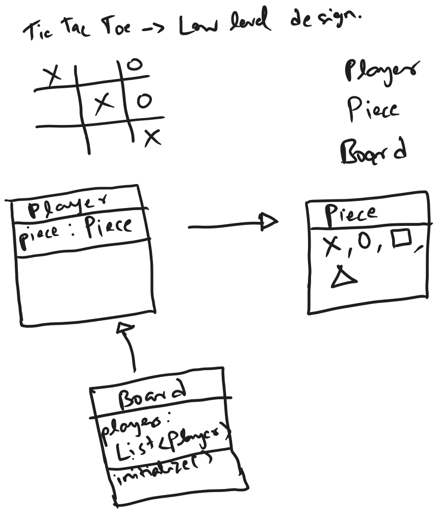
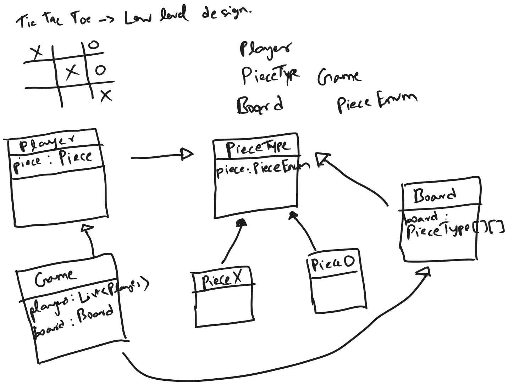

## Basic approach

the above approach is not extensible and wrong
since the board just contains list of players and no information about the pieces

## Updated approach

this approach is extensible as it can support board of different sizes and players of different pieces

this in turn allows to have more players
