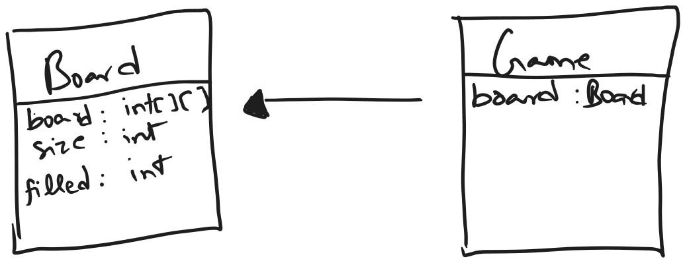
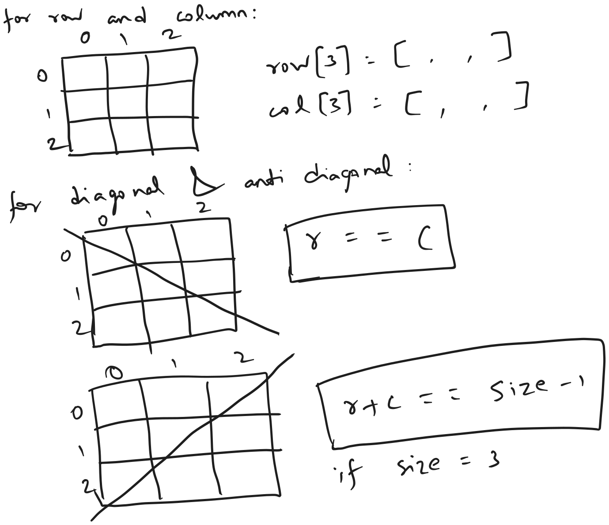

## Basic approach

minimizing the players to only two

## Updated approach

in this approach number of players is assumed to be 2. hence there is no need for a separate enum or class for piece.

## Optimized approach

validating the board can be optimized to $O(1)$

using two arrays for row and column and two variables for diagonal and anti-diagonal

